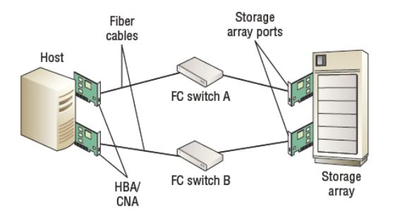

# Introduction

## Storage Area Network (SAN)

SAN uses a centralized shared storage. This allows for more consistency in dealing with the storage and tool usage.

It is also a very secure architecture since it only allows for simple operations like reading and writing files.

## Fibre Channel Protocol

FCP is commonly used with the SAN architecture. It allows for a low-latency and loss-less delivery of data, unlike TCP and UDP, between data storages or server devices. It can deliver up to 128 GB/s of data.

## Fibre Channel SAN Components

A minimal Fibre Channel SAN setup would include

* A server. Also known as the initiatior. This is the server that will have control over a certain portion of the storage.

* 1 or more FC Switches. It is generally better to have more than one switch connecting every server to the storage just in case one of them is physically damaged and needs replacement.

* The storage system.

## Setup and Security

Fibre Cabels will connect the server (initiator) to the FC Switches which are already connect to the storage system.

Both the server (initiator) and the storage systems have a unique 64-bit, represented as 16 Hexadecimal values, WWN (World Wide Name) attached to them and both of these are stored on the FC switches.

Using those WWN's stored on the FC Switches, we can create a zoning for a certain number of servers (initiators). Zoning allows us to control which servers (initiators) are allowed to communicate with each other and to prevent any unknown connections to the data storage system.

The last step would be LUN Masking. A LUN (Logical Unit Number) represents a disk that will be presented to the server (initiator). This step is very important as it assigns which server can have access to a specific portion of the data storage (LUN). This prevents multiple servers from accessing the same data and eventually lead to data corruptions.

