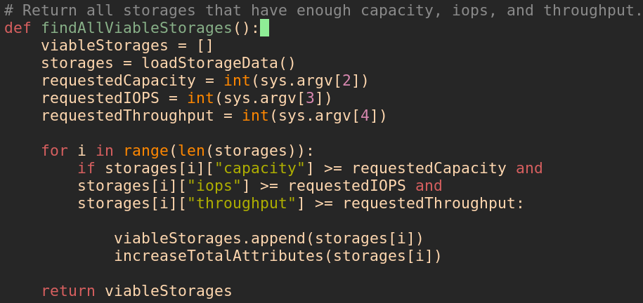
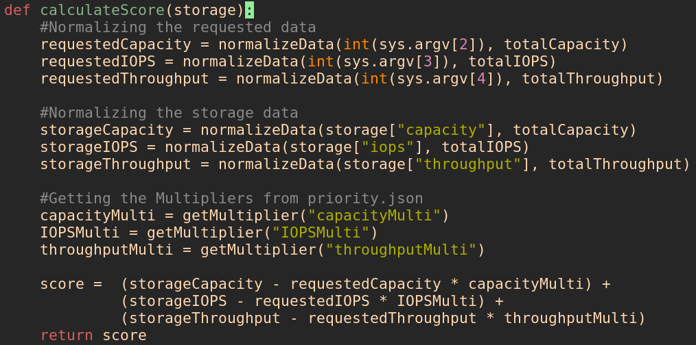
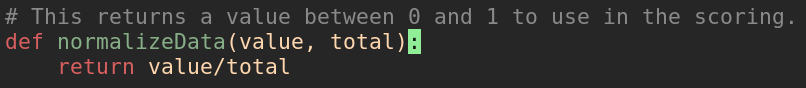
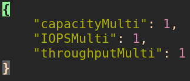
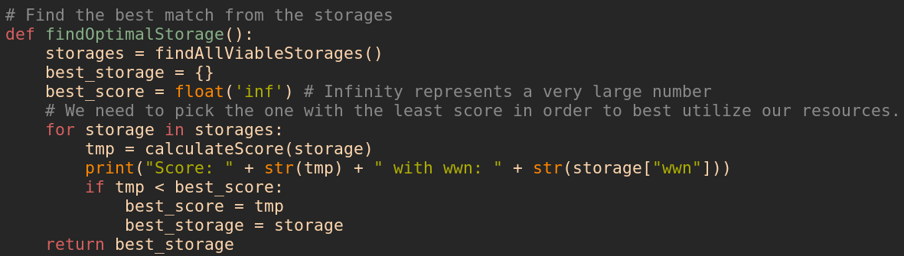

# The Problem

We would like to automate the process of installing new servers to the system. We would like to choose a storage so that we can optimize the overall resouces of the system. A certrain capacity, IOPS, and throughput will be requested and we need to find the optimal storage to assign these resources.


## Solution Idea

A simple solution but very efficient and scalable.

The idea is we need to find the storage that fits our request best without wasting any resources.

For example: If we have a 30/40 TB storage and a 20/40 TB storage and the request is asking for 10TB then we will assign it the storage with 30/40. But we have to apply this idea to all the fields including IOPS and Throughput.

## Implementation

Here is an overview of the structure.

```bash
compute.py extractor.py storages.json priority.json
```

extractor.py is responsible for extracting the data of the existing storages and converting them into json format and output them inside the storages.json file.

### Filtering the storages

compute.py will take the JSON array supplied by storages.json and filter it over multiple steps in order to find the best match.

First we loop over the all the existing storages to find the storages that have enough capacity/iops/throughput

{width=70%}

Now once we have an array of all the viable storages we need to know which one fits the best. In order to do that we need to calculate a score for each storage and the lowest score will be the closest to the requested resources.

{width=70%}

### Normalizing the data

In order to create a score for each storage we need them to have the same units since they are different. We can do this by calculating the total Capacity, IOPS, and Throughput and dividing each of the resources by the total to get a value between 0 and 1.

{width=70%}

### Prioritising

If we wanted to focus more on optimizing capacity for example, we can head into the **priority.json** file and change the capacity multiplier to a higher value. Increasing this value will make the capacity affect the score less, which means we will get a lower score.

{width=50%}

### Choosing the best storage

After calculating the scores for each storage we simply go over the scores to find the lowest one and return the corresponding storage.

{width=70%}

### Usage

```bash
python3 compute.py storages.json <requestedCapacity> <requestedIOPS> <requestedThroughput>
```

### Other ideas

* If we only care about optimizing one resource like Capacity for example we can simply sort all the storages and binary search for the requested capacity and return the one that is equal to it or exactly above it.

* Use Machine learning and Data analysis to find the optimal storage using Historic Data.

Those scripts can be a good base for a machine learning implementation. The machine learning could possibly only make changes to the **priority.json** file and change the multipliers to pick the perfect storage.

